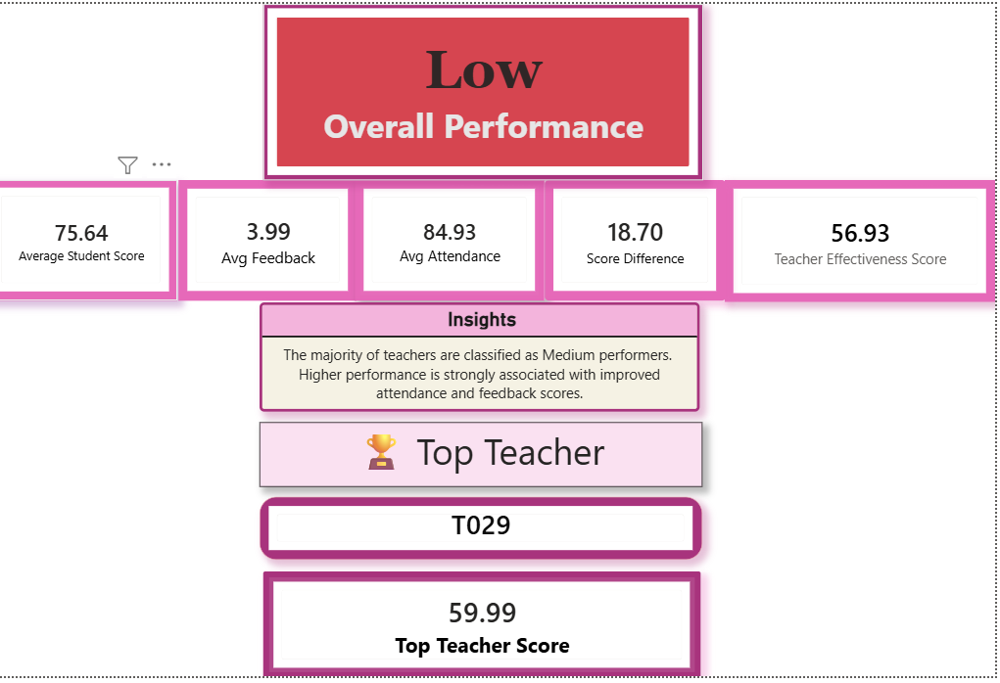
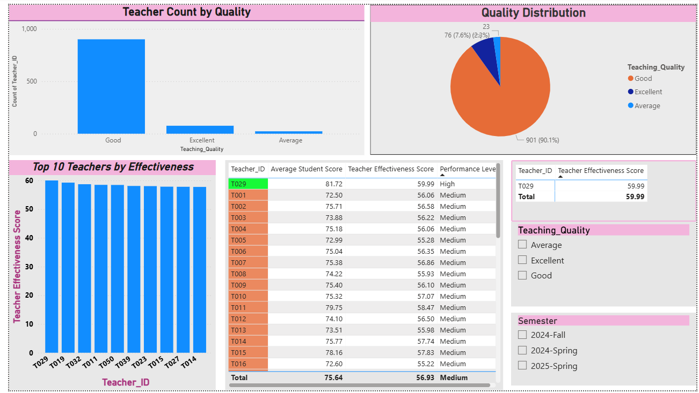

# 📊 Teacher Effectiveness Dashboard

This Power BI dashboard analyzes teacher performance and effectiveness using key metrics such as student scores, attendance, and feedback.

## 🔍 Overview
The dashboard provides:
- Overall performance classification
- Top teacher identification
- Key performance indicators (KPIs)
- Detailed analysis of teaching quality

## 📌 Key Insights
- Most teachers are classified as Medium performers
- Higher performance is associated with better attendance and feedback scores

## 🛠 Tools Used
- Power BI
- DAX

## 📷 Dashboard Preview

### Executive Summary

### Detailed Analysis

## 📁 Files Included
- `.pbix` Power BI file
- `.pdf` dashboard export
- Dashboard screenshots

---

👩‍💻 Created by Sabrin Khater
